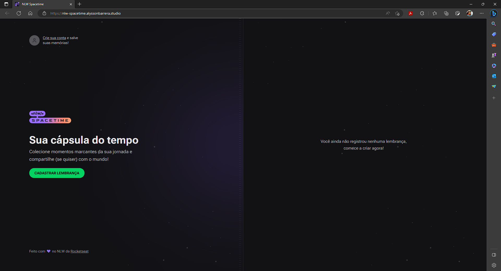
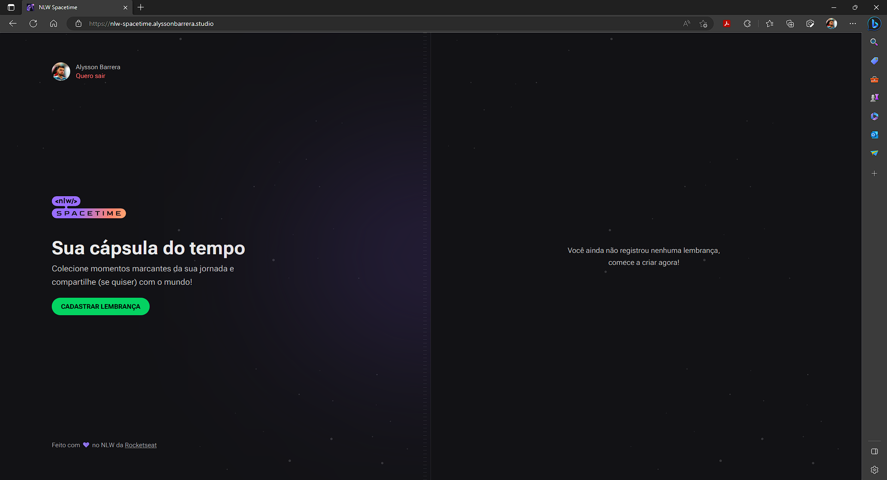
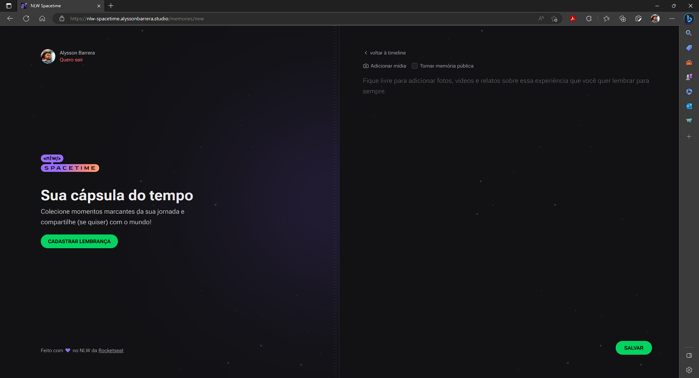
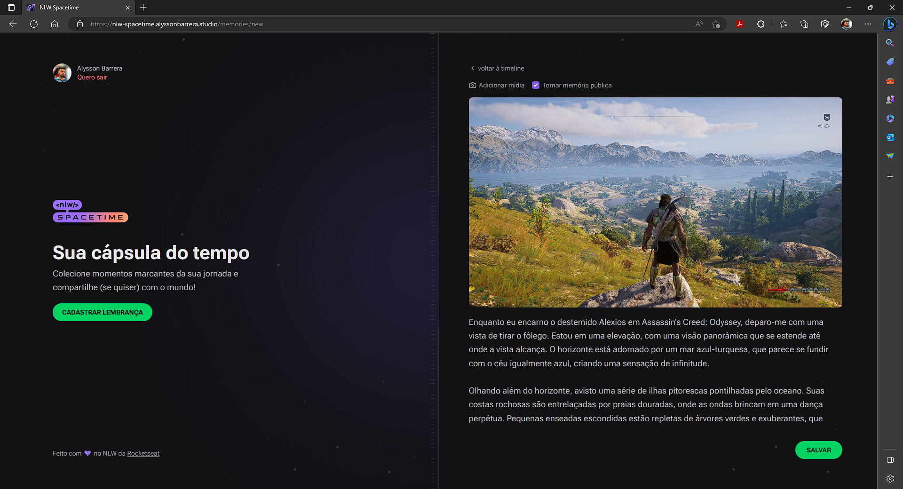
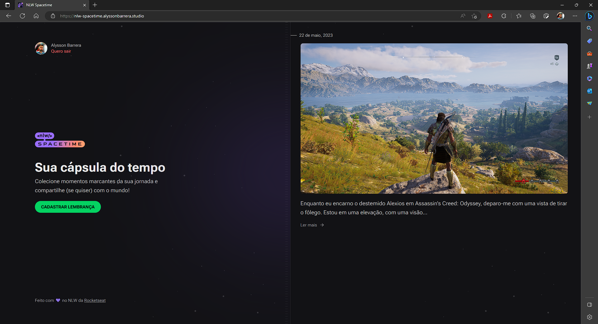

# Cápsula do Tempo - NLW Spacetime | Rocketseat

## Português

#### Página Web de registro de memórias

A aplicação foi desenvolvida em React, utilizando TypeScript, TailwindCSS, Next.js e outras bibliotecas. Ela consome uma API REST que permite visualizar, cadastrar, editar e excluir memórias.

## English

#### Memory Recording Web Page

The application was developed in React, using TypeScript, TailwindCSS, Next.js, and other libraries. It consumes a REST API that allows viewing, creating, editing, and deleting memories.

## Screenshots

    

        
        
        
        
        
    

## Stack

   
